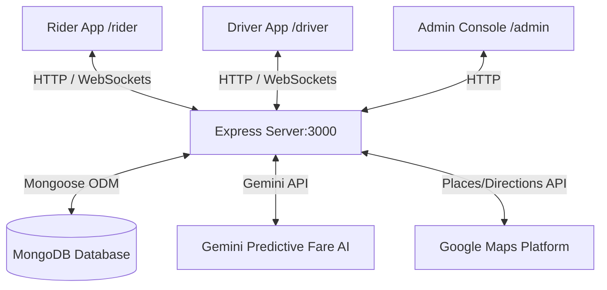

# RideConnect – Enterprise-Grade Uber-like Ride Booking Platform

RideConnect is a production-ready, full-stack ride-hailing application built with React, Node.js, Express, MongoDB (Mongoose), and Socket.io. It integrates the Rider Web Portal, Driver Web Portal, and Admin Console into a highly cohesive, containerized application suite.

---

## 🚖 Architecture Overview



---

## 🛠️ Technology Stack

- **Frontend**: React, Redux Toolkit, React Router DOM, Tailwind CSS, Framer Motion, `@vis.gl/react-google-maps`, `socket.io-client`.
- **Backend**: Node.js, Express.js, Mongoose, Socket.io, JWT (Access/Refresh Tokens), bcryptjs.
- **Database**: MongoDB (Atlas or Local container).
- **Deployment**: Docker, Docker Compose.

---

## 📂 Project Structure

```text
ridex/
├── backend/
│   ├── config/             # DB Mongoose connection
│   ├── controllers/        # Express REST controllers (auth, ride, user)
│   ├── middleware/         # Auth verification and role gates
│   ├── models/             # Schema definitions (User, Driver, Ride, etc.)
│   ├── routes/             # REST endpoints (/api/v1/auth, /api/v1/rides)
│   ├── socket/             # Sockets handler logic for location sync
│   └── utils/              # JWT & OTP token generation
├── src/
│   ├── components/         # Page frames (PassengerApp, DriverApp, AdminPanel)
│   ├── store/              # Redux slices (auth, rides)
│   ├── hooks/              # custom useSocket connector hook
│   └── App.tsx             # React Router pathways
├── Dockerfile              # Multi-stage production container setup
├── docker-compose.yml      # Orchestrates application + mongo database
└── README.md
```

---

## 🔒 Socket.io Event API

| Event | Direction | Payload | Description |
| :--- | :--- | :--- | :--- |
| `join` | Client ➔ Server | `roomName` | Binds connection to specific User or Active Ride ID room |
| `driver:location_update` | Driver ➔ Server | `{ driverId, lat, lng, rideId }` | Reports location; syncs passenger map in real-time |
| `ride:request` | Rider ➔ Server | `{ rideData }` | Broadcasts trip requests to all online drivers |
| `ride:accept` | Driver ➔ Server | `{ rideId, driverId, driverName }` | Triggers matched driver confirmation to rider |
| `ride:status_update` | Driver ➔ Server | `{ rideId, status }` | Shifts trip lifecycle state (arrived, active, completed) |
| `chat:message` | Client ➔ Server | `{ rideId, senderRole, message }` | Direct messaging channel inside active trips |

---

## 🚀 Running the Platform

### Option A: Local Dev Setup

1. **Install Dependencies**:
   ```bash
   npm install
   ```

2. **Configure Environment Keys**:
   Create a `.env.local` file in the root directory:
   ```env
   MONGODB_URI=mongodb://localhost:27017/rideconnect
   JWT_SECRET=your_jwt_secret_key
   JWT_REFRESH_SECRET=your_refresh_secret_key
   GOOGLE_MAPS_PLATFORM_KEY=your_google_maps_key
   GEMINI_API_KEY=your_gemini_api_key
   ```

3. **Start Development Server**:
   ```bash
   npm run dev
   ```
   Open **http://localhost:3000** in your browser.

---

### Option B: Docker Containers (Recommended for Production)

Run the entire stack (Node backend, React bundle, and MongoDB database) with a single command:

```bash
docker-compose up --build
```

The server binds to port `3000` and MongoDB container binds to port `27017`.

---

## 🧪 Verification & Testing

To run the TypeScript compilation checks:
```bash
npm run lint
```
To run mock database clean-ups, navigate to **http://localhost:3000/admin** and click **Clear DB Pools**.
